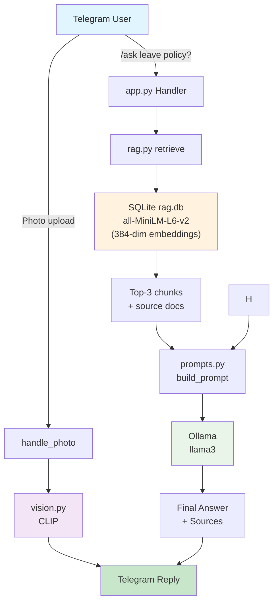

# Mini-RAG Telegram Bot with Vision

A Telegram bot that answers questions from your own documents (RAG) and can also describe uploaded images.
Runs fully locally using Ollama, sentence-transformers, and CLIP.

---

## What this bot does

- **RAG (Retrieval-Augmented Generation)**
  Answers questions strictly from your local text/markdown files.

- **Local LLM (via Ollama)**
  No OpenAI or cloud APIs required.

- **Image understanding**
  Describes uploaded images using a CLIP vision model.

- **Telegram interface**
  Simple commands, fast responses, memory caching.

---

## Project structure

```
.
├── app.py
├── rag.py
├── prompts.py
├── vision.py
├── config.py
├── data/
├── rag.db
└── requirements.txt
```

---

## How to run locally (Python)

### Prerequisites
- Python 3.9+
- Telegram bot token
- Ollama installed and running

Pull model:
```
ollama pull llama3
```

### Install dependencies
```
pip install -r requirements.txt
```

### Configure
Edit `config.py` and add your bot token.

### Run
```
python app.py
```

---

## Telegram commands

- `/start`
- `/ask <question>`
- `/image`
- Upload a photo

---

## Example Telegram interactions

**/ask**
```
User: /ask What is this project?
Bot: This project appears to be a set of company policies regarding remote work and employee leave ...
```
**/image**
```
User: /image
Bot:
Please send me a photo! I'll describe it and give tags.
Or use /ask for text questions.
```
**/history**
```
User: /history
Bot:
**Your recent 2 interactions:**

1. Q: what is this project...
   A: This project appears to be a set of company policies regarding remote work and e...

2. Q: what about leave policy...
   A: According to the context, there is a leave policy that outlines rules and proced...
```
**/summarize**
```
User: /summarize
Bot:
**Conversation Summary:**
Here is a 2-3 sentence summary of the conversation:

The project appears to be a set of company policies regarding remote work and employee leave. T...

```
**Image upload**
```
User uploads image
Bot: A wide photo showing a street
Tags: Street, Building, Outdoor
```

---

## Models and APIs used

- Embeddings: sentence-transformers/all-MiniLM-L6-v2
- LLM: llama3 via Ollama
- Vision: openai/clip-vit-base-patch32

---

## System Design Diagram



---